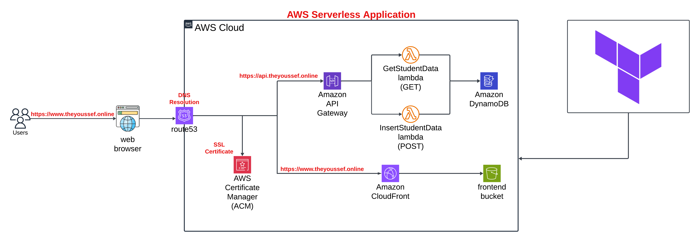

# Serverless Application

This repository contains a serverless application designed to provide student information .

## Architecture



The application architecture consists of the following components:

- **Frontend**: Deployed to S3, served using CloudFront, and DNS managed via Route 53.
- **Backend**: Includes AWS Lambda functions for adding and retrieving tasks, with a DynamoDB database for data storage.
- **Infrastructure**: Managed using Terraform to automate the creation and configuration of all AWS resources.

---

## Prerequisites

To set up and deploy this project, ensure you have the following installed and configured:

1. **Terraform**: [Download Terraform](https://www.terraform.io/downloads.html)
2. **AWS CLI**: [Install AWS CLI](https://aws.amazon.com/cli/) and configure it with your AWS credentials:
   ```bash
   aws configure
3. **Python**: [Download Python](https://www.python.org/downloads/) for creating and packaging the Lambda functions.
4. **Node.js**: [Download Node.js](https://nodejs.org/) for building the frontend files.

## Setup Instructions

### Clone the Repository:
```bash
git clone https://github.com/youssef-138/serverless.git


